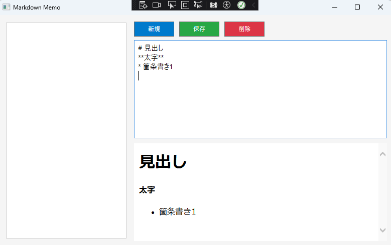

# シンプルメモ帳アプリ

## 概要

C#で開発したシンプルなメモ帳アプリです。テキストファイルの作成、編集、保存が可能です。

## 機能

* テキストファイルの新規作成
* テキストファイルの読み込み
* テキストファイルの編集
* テキストファイルの保存
* 文字コードの選択（UTF-8, Shift-JIS）
* シンプルなUI

## 技術スタック

* C#
* .NET Framework 4.8
* Windows Forms
* Visual Studio 2022

## インストールと実行方法

1.  リポジトリをクローンします。
2.  Visual Studioで`SimpleNotepad.sln`を開きます。
3.  ビルドを実行します。
4.  `SimpleNotepad\bin\Debug\SimpleNotepad.exe`を実行します。

## 使い方

1.  メニューバーの「ファイル」から「新規作成」「開く」「保存」「上書き保存」を選択します。
2.  テキストエリアにテキストを入力・編集します。
3.  メニューバーの「文字コード」から文字コードを選択します。

## 開発背景と目的

C#のWindows Formsアプリケーション開発の練習として、シンプルなメモ帳アプリを開発しました。基本的なテキストファイルの操作やUIの実装を学びました。

## 工夫した点と苦労した点

* 文字コードの選択機能を実装する際に、Encodingクラスの扱いを学びました。
* UIのレイアウト調整に苦労しました。

## 今後の展望

* 検索機能の追加
* アンドゥ・リドゥ機能の追加
* UIの改善

## スクリーンショット

## 著作権とライセンス

MIT License

Copyright (c) 2023 Your Name

## 連絡先

[your\_email@example.com](mailto:your_email@example.com)
